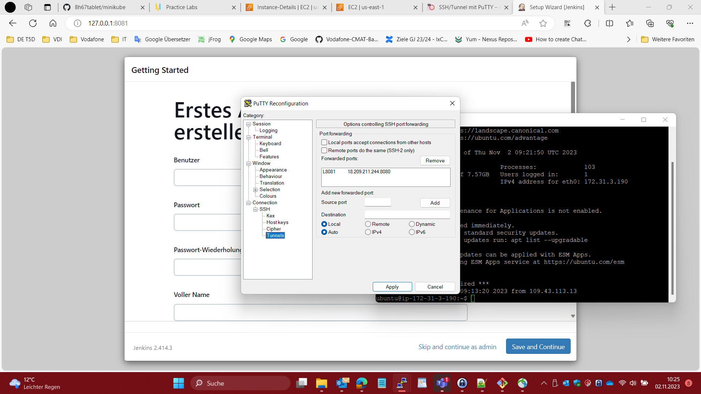

# simplilearn_aws
aws
1. secrets im repository anpassen
2. vpc und subnet id kopieren und in variables.tf aktuallisieren
3. simplilearn_key erstellen
4. run: .github/workflows/awsS3.yml
5. run: .github/workflows/awsWorkerIAM.yml
6. awsMasterIAM/variables.tf: vpc, subnet und securityGroup aktuallisieren
7. run: .github/workflows/awsMasterIAM.yml

